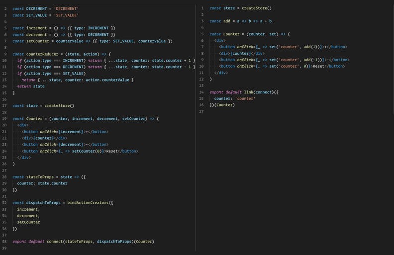

<h1 align="center">Simple state management</h1>
<p align="center"><b>No Actions. No reducers. Just code.</b></p>
Based on Redux, but has no boilerplate and with async flow in mind</br>

<details>
  <summary>Show me code</summary>

  
</details>

# Installation
package is available on NPM for use with a module bundler or in a Node application:
```Bash
# NPM
npm install --save flat-state
# Yarn
yarn add flat-state
```

# Getting started
You don't need to create reducer and actions. All you need to do is to create store. And use it the way shown in code below.

```JavaScript
import { createStore, set } from 'flat-state'

const initState = { counter: 0 } // can be omitted. By default init state is {}
const store = createStore(initState)
const inrement = x => x + 1
const decrement = x => x - 1

store.subscribe(() => console.log(store.getState()))

store.dispatch(set('counter', 0))
// {
//   counter: 0
// }
store.dispatch(set('counter', increment))
// {
//   counter: 1
// }
store.dispatch(set('counter', increment))
// {
//   counter: 2
// }
store.dispatch(set('counter', decrement))
// {
//   counter: 1
// }
```

## Set
`set` function in it's simplest form has following signature

```set :: Lens -> Updater -> StateA -> StateB```

### Lens
`Lens` is the lens to property in the state you want to update `a.b[0]` transforms to the object
```Javascript
{
  a: {
    b: []
  }
}
```

so `set('a.b[0]', {name: 'John'})` unwraps to
```JavaScript
{
  a: {
    b: [{ name: 'John' }]
  }
}
```
### Updater
From the example with counter you can see that `Updater` might be not only a data, but also a function as `increment`/`dicrement`. Function will be invoked with current value on `Lens`. It's useful when state updates depend on previous values.

Keep in mind, that function sould be **pure**.
```JavaScript
set('counter', 0) // Set value 0 to by lens 'counter'
// { counter: 0 }
set('counter', counter => counter + 1) // Invoked with 'counter' equals 0
// { counter: 1 }
```

# Simplified abstraction
Instance of `store` extended with `.set` method which is whrapper over `dispatch(set())`. So you can dispatch updates even simpler. Let's refactor **Counter** example using `.set`
```JavaScript
import { createStore } from 'flat-state'

const store = createStore()
const inrement = x => x + 1
const decrement = x => x - 1

store.subscribe(() => console.log(store.getState()))

store.set('counter', 0)
// {
//   counter: 0
// }
store.set('counter', increment)
// {
//   counter: 1
// }
store.set('counter', increment)
// {
//   counter: 2
// }
store.set('counter', decrement)
// {
//   counter: 1
// }
store.set('user.firstName', 'John')
store.set('user.secondName', 'Doe')
store.set('user.nickName', 'Incognito')
```
You can export `.set` from the file where `store` created and use it directly in you code
```JavaScript
import { createStore } from 'flat-state'

const store = createStore()
const set = store.set

export { set }
```
**Next store updates in this doc use `.set` method. But you can import `set` as standalone function as shown in [Getting started]:(#getting-started) if you prefer so.**</br>
# Multi values updates
As you see from previouse part setting user looks too wordy, and more, it invokes subscribers each time you `.set`. In fact `.set` can help you to avoid that behaivior if you want to set multiple values on different `Lenses`. Let's refactor!
```JavaScript
store.set({
  'user.firstName', 'John',
  'user.secondName', 'Doe',
  'user.nickName', 'Incognito'
})
```
_Sure in this case you can just `.set` user object on `user` lens, but you got the point_

So in fact `.set` has another use case
```JavaScript
store.set({
  Lens: Value,
  Lens: Value => NewValue,
  ...
})
```
_As you see you're not limited to set values, `Updater` might be a function_

# Asyncronous updates
Application doesn't exist in a vacuum. It communicates with server and has asyncronous logic. Let's review this use case
```JavaScript

const getUser = userId => fetchUser(userId)

store.set({
  user: getUser(1)
})
```
To better understand what will be result of this code, let's take a closer look on return data and how we gonna use it in a application. Any async flow assumes the following

- response has some state **resolved**/**in-progress**
- response might be resoleved with **data** or with **error**

Here's how we most likely to use it in React component
```
const User = ({userId, user, set}) => {

  useEffect(() => {
    set('user', getUser(userId))
  }, [userId])

  if(user.isLoading) return 'Loading user ...'
  if(user.error) return 'Can\'t get data'
  return (
    <div>
      <div>{user.data.firstName}</div>
      <div>{user.data.secondName}</div>
      <div>{user.data.nickName}</div>
    </div>
  )
}
```
So every time `Updater` is `Promise` or returns it. Following shape will be created on a `Lens`
```JavaScript
{
  isLoading: true,
  data: null,
  error: null
}
```
That is the initial state of request, and as soon as promise resolved this data updated with `error`, `data` and `isLoading` change.</br>
Just keep in mind, that there is no magic here, and initial data (with `isLoading: true`) set syncronously and response will be set some time in future.</br>
Les's take a look
```JavaScript
import { createStore } from 'flat-state'

const store = createStore()

store.subscribe(() => console.log(store.getState()))

store.set('user', Promise.resolve({
  firstName: 'John',
  secondName: 'Doe',
  nickName: 'Incognito'
}))
console.log(store.getState())
// {
//   user: {
//     isLoading: true,
//     data: null,
//     error: null
//   }
// }
setTimeout(() => {
  console.log(store.getState())
// {
//   user: {
//     isLoading: true,
//     data: {
//       firstName: 'John',
//       secondName: 'Doe',
//       nickName: 'Incognito'
//     },
//     error: null
//   }
// }
}, 0)
```
In this case `store` updated with actual data on next tick

# Using with React
Package provide `link` factory to connect React componets to redux state. It requires `connect` function from `'react-redux'`.</br>
Check out code above to see how you create `link`. When you link your React component, you will get props defined and `set` function.
```JavaScript
import React from 'react'
import {link as rawLink} from 'flat-state'
import {connect} from 'react-redux'

// set, and data from store appiears in props
const UserComponent = ({userData, set, userId, ...props}) => <User userData={userData} />

// create your link fucntion from link factory ones in your app
// then link your components
const link = rawLink(connect)

// provides data from state ans set function
// link({
//   componentProp: Lens
// })(UserComponent)

// provides only set function
// link(UserComponent)

export default link(ownProps => ({
  userData: `users.${ownProps.userId}`
}))(UserComponent)
```

# Happy coding